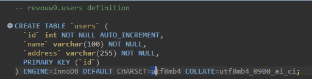
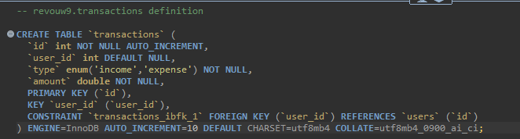

# Express MySQL API

This project provides a RESTful API built using Express.js and MySQL for managing users and their transactions.

## Features

- Fetch details of all users.
- Retrieve a specific user's details, including a summary of their balance and expenses.
- Manage transactions for users: create, update, and delete transactions.

## Prerequisites

- Node.js installed
- MySQL server running

## Creating Database Table

- Users Table

- Transactions Table

## API Endpoints

| Method | Endpoint           | Description                      | Parameters / Body                                 |
| ------ | ------------------ | -------------------------------- | ------------------------------------------------- |
| GET    | `/users`           | Retrieve all users.              | None                                              |
| GET    | `/users/:id`       | Fetch a specific user's details. | `id`: User ID                                     |
| POST   | `/transaction`     | Create a new transaction.        | `user_id`, `type` (income/expense), `amount`      |
| PUT    | `/transaction/:id` | Update an existing transaction.  | `id`: Transaction ID, `user_id`, `type`, `amount` |
| DELETE | `/transaction/:id` | Delete a specific transaction.   | `id`: Transaction ID                              |

---.
